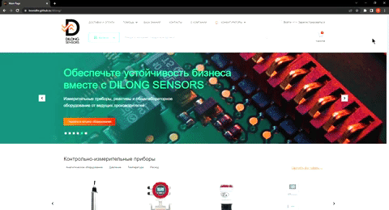

# \#Dilong site layout

Layout of a multi-page online store

## \#How to use
__Running code__
```
npm i
```
__After__
```
npm run dev
```
__For build project__
```
npm run build
```

## \#Demo
[https://leonidhr.github.io/dilong/](https://leonidhr.github.io/dilong/)



## \#Features
* Popups and forms validation
* Filter and search form on knownlange and documents pages
* Tabs on delivery page


## \#Libraries

## \#Sending emails

__In order for sending letters to mail to work, you need to add the [PHPMailer pragin](https://github.com/PHPMailer/PHPMailer) to the root of the project__

[Swiper](https://swiperjs.com)

``` js
import Swiper, { Navigation, Pagination, Parallax, Autoplay } from 'swiper';
```
### \#Dynamic adaptive
[Author](https://github.com/FreelancerLifeStyle/dynamic_adapt)
```
src/js/files/dynamic_adapt.js
```
__Using__

``` html
 <a data-da=".block,991.98,last" href="#">Button</a>

 <a data-da=".block,991.98,first" href="#">Button</a>
```

* First example: on a screen extension of 992px, the button is moved to the end of the block

* Second example: on a screen extension of 992px, the button is moved to the start of the block

## \#Folder structure

src - source files. gulp - gulp config files. dist - ready files for perview. dist branch - project perview.

## \#Important

Header logo looks normal only after building

```SCSS
picture {
      max-width: 100%;

      &:nth-child(1) {
        display: block;
        animation: headerShow 0.5s ease 0s;
      }

      &:nth-child(2) {
        display: none;
      }

      &:nth-child(3) {
        display: none;
      }
}
```